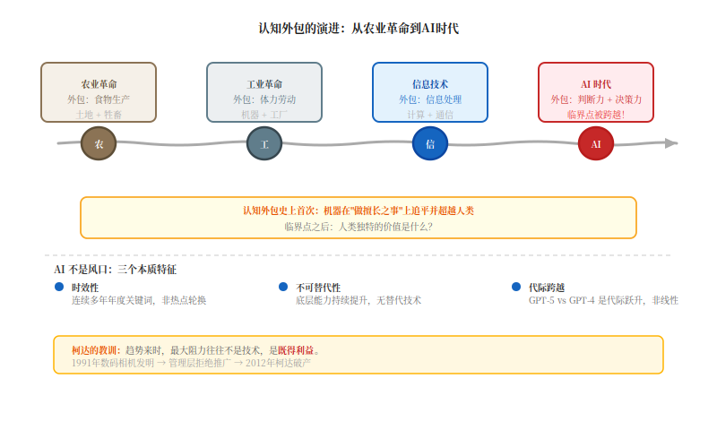

# PART I · 时代背景

# 第一章：AI不是风口，是文明级转折

*"我们倾向于高估技术在短期内的影响，低估其在长期的影响。"*
——罗伊·阿马拉

这话被引用了无数次，但我每次看到都觉得它描述得太准确了。

---

每逢新技术出来，舆论都要走一遍这个剧本：先是"这玩意儿要改变世界"，然后是"也没那么玄乎"，最后才是在真正的影响悄悄发生的时候，发现已经来不及了。

互联网走过这个剧本，物联网走过，区块链也走过。

但AI好像没按剧本演。

或者说，它把这个剧本压缩了——紧到我们还没来得及说"也没那么厉害"，就直接被推进了"它正在改变一切"的现实里。

打个比方，就像电影里演的那样：上一秒男主还在誓师大会上振臂高呼"相信我，我们一定能改变世界！"下一场戏就直接跳过质疑、困难、胜利，全剧终了，字幕出现。

2016年，AlphaGo赢了李世石。那时候全网讨论的是什么？"AI会下棋了，牛逼！"和"哪些工作会被取代啊？下棋的呗！"

没人认真想过，那场胜利跟围棋其实没多大关系。**它证明的是：在那些被认为需要"直觉"和"经验"的领域，机器可以超越人类。**这不是关于棋类的故事，这是一个认知边界的宣告。

说到这，想起一个老掉牙的故事——柯达。

1991年，柯达的工程师Steven Sasson发明了世界上第一台数码相机，兴冲冲地给管理层演示。管理层听完，说什么呢？"这个……看起来不错，但是……我们卖胶卷卖得好好的，为什么要推广这个？"

后来的事情大家都知道了。2012年，柯达破产。

柯达的经理人是傻子吗？他们不知道数码化是趋势？肯定不都是傻子。他们只是被"卖胶卷能赚钱"这个当下困住了，忽视了那个正在到来的未来。

**趋势来的时候，最大的阻力往往不是技术，是既得利益。**

扯远了，拉回来。

十年后回头看，AlphaGo只是第一道涟漪。GPT、Claude、Gemini、文心、通义……这些大语言模型的能力边界，不到六个月就刷新一次。能写报告编代码，能画画拍电影，能分析财报，几秒钟读完一个人十年才能读完的文献。

它们不是工具，不是助手，不是副驾驶。

**它们正在变成某种我们还没想好怎么命名的东西。**

这不是风口。风口会过去，AI看起来不会。

---

为什么AI不是风口？

先说风口是什么。风口本质上是资本和媒体的一块叙事建构。套路大家都熟：某技术被吹成"即将改变一切" → 钱涌进来 → 估值上天 → 媒体跟进 → 然后呢？没了，因为下一个风口来了。团购走过这套路，共享经济走过，VR/AR走过，元宇宙走过……

风口有几个特点：

**时效性**——每隔几年就换一个热点。2012年移动互联网，2016年直播，2021年元宇宙，各领风骚三五年，然后过气。但AI不一样，它连续多年都是"年度关键词"，热度还在加速。就好比你天天上热搜的都是各种明星，但有一个是雷打不动的流量担当——AI就是那个"老公"。

**可替代性**——风口意味着有别的风会来吹。团购之后是共享单车，共享单车之后是社区团购。但AI不一样，它的底层能力在持续提升，不是被竞争挤下去的。你听说过"AI 2.0""AI 3.0"吗？没有吧。因为每次说的都是同一个AI，只是它越来越强了。这就好比——你听说过"电 2.0"吗？"互联网 3.0"？也没有吧。电和互联网不是风口，它们是基础设施。基础设施只有迭代，没有替代。

**边际效应递减**——大多数技术早期风光，越往后越难突破。手机厂商现在吹的都是什么？"我们的摄像头又提升了0.1个像素！""我们的边框又窄了0.01毫米！"但AI不一样，GPT-5比GPT-4的跃升不是边际改进，是代际跨越。这差距，大概相当于从iPhone 4到iPhone 15。

但AI最本质的不同，还不是这些技术特征。

**它影响的是人类认知本身。**

---

人类文明史，很大程度上是认知外包的历史。

农业革命把食物生产外包给土地和牲畜，工业革命把体力劳动外包给机器，信息技术把信息处理和传递外包给电脑。每次外包，都跟着人类能力的重新定义和社会结构的重组。

AI带来的外包，是认知外包的新形态：**把判断力和决策力外包给AI。**

从计算器取代手工算术，到GPS取代空间记忆，人类一直在外包认知功能。但过去外包的，都是我们不想做的事，或者做不好的事。

AI不一样。它正在外包我们最引以为傲的东西：分析、推理、创造、表达。ChatGPT写的商业方案，比大多数MBA毕业生好。Midjourney生成的插画，比大多数设计师快。Copilot写的代码，比大多数程序员bug少。

这不是"替代"那么简单。

**这是认知外包史上第一次，机器在"做我们擅长的事"这个维度上，追平并超越了我们。**

这个临界点被跨越之后，我们不得不重新回答一个问题：**人类独特的价值是什么？**

---

正式展开之前，先说三个最常见的误区。

**误区一：AI只是工具。**

"AI只是工具"这个说法太常见了。潜台词是：AI和汽车、飞机、电脑一样，是人类能力的延伸，我们只需要学会用它。

汽车延伸了腿，飞机延伸了翅膀，电脑延伸了计算能力——但这些延伸都是线性的、不改变人作为主体地位的。

AI不同。AI不是延伸某项具体能力，而是提升认知的维度。它不是给你的能力加速度，而是让你进入一个之前根本进不去的思考空间。这不是工具升级，是认知升维——就像从二维平面进入三维空间，从牛顿力学进入量子力学。

**更准确的说法是：AI是认知升维的载体。** 它带来的不是"更好地做同一件事"，而是"做之前根本不可能做的事"。

**误区二：AI是革命。**

"AI革命"是另一个流行叙事。潜台词是：旧世界将被颠覆，新秩序将建立，非此即彼的断裂时刻到了。

但"革命"这个框架，有问题。

首先，它暗示断裂。但组织变革从来不是断裂的。组织不是推倒重建的房屋，而是持续运转的生命体。真正的变革，从来不是戏剧性的，而是系统的、持续的、有纪律的工作。

其次，"革命"叙事会让组织陷入两种坑：要么是"一切都变了"导致的行动瘫痪，要么是"我们已经革命了"导致的表面文章。

**误区三：AI是竞争手段。**

"我们必须尽快采用AI，否则会落后"——这是企业界最常见的焦虑。把AI首先视为竞争手段，会导致一个短视的问题：**用AI做什么？**

这个问题听起来务实。但它遮蔽了更根本的问题：**有了AI之后，你想成为一个什么样的组织？**

竞争框架下的AI战略是外向的——盯着对手。但AI带来的变革，首先是内向的——它要求组织重新审视自己的核心能力、价值主张、存在的理由。

---

AI之所以是文明级转折，是因为它在三个维度上同时发力。

**第一个维度：生产方式的重组。**

工业革命把自给自足的农业社会改成了工厂分工协作。知识经济把体力劳动外包改成了知识工作者的专业化服务。AI正在把知识工作者的专业化服务，改成某种我们还没定义清楚的新形态。

麦肯锡估算，AI可以在2030年前为全球经济贡献约13万亿美元。但"创造价值"只是生产方式重组的一个方面，另一方面是价值分配。

历史上，每次重大技术革命都加剧贫富分化。不是技术本身制造了不平等，而是技术的收益集中在了少数掌握新技术的人手中。

所以问题来了：**你是掌握新技术的少数人，还是将被淘汰的群体？**

**第二个维度：知识权威的迁移。**

人类文明大部分历史中，知识权威来自于经验和传承。老农的耕作知识，手工匠人的技艺，资深经理人的判断力——这些都需要时间积累，需要师徒关系传承。

AI打破了这个逻辑。大语言模型几秒钟就能调取人类几百年积累的知识。

当AI比大多数医生更准确地诊断疾病时，医生的权威从哪里来？当AI比大多数律师更准确地解读法律时，律师的价值是什么？

波士顿咨询的调研问企业："AI替代了你的员工之后，人类存在的价值是什么？"大多数企业没有清晰答案。这个问题不解决，AI替代就只剩下成本削减的意义。

**第三个维度：人性的重新定义。**

这是最深的维度，也是最少被讨论的。

几千年了，人类定义自己为"会思考的动物"。AI在某些维度上的思考能力已经追平甚至超越人类，这意味着"会思考"不再是人区别于万物的独特标志。

这个问题要求我们重新回答：**人的价值，不在于他能做什么，而在于他是什么。**

德鲁克在1990年代的《后资本主义社会》中说过，知识工作者的核心价值不在于拥有知识，而在于能够将知识转化为生产力。但AI让这个判断变得复杂：**如果机器也能创造价值，人的独特价值又在何方？**

---

说到这里，可能有人要问：你讲了半天的AI和管理，和德鲁克有什么关系？

好问题。

德鲁克的管理思想诞生于20世纪中叶。他不属于任何一个管理学派，不属于任何一个商业时代。他属于那些永恒的问题。

泰勒的科学管理原理让工厂效率提升了10倍，但它没有回答：**效率是为谁服务的？**

丰田的精益生产让全球制造业震惊，但它没有回答：**当机器可以比人做得更好时，人的价值在哪里？**

AI时代，这些问题不再是哲学思考的素材，而是生存必须回答的战略问题。

德鲁克1980年写《动荡时代的管理》时，互联网还没有商业化。他不可能预见到AI。但他的方法论——从本质出发，追问组织存在的根本理由——让他的思想在任何时代都保持着生命力。

---

说到底，这本书想探讨的是：AI时代，什么样的组织才是好组织？

这个问题太大，我答不了。但我知道一件事——研究这个问题，德鲁克是最好的起点。不是因为他说的话句句正确，而是因为他问问题的方式始终正确：什么是本质？什么该做，什么不该做？

技术在变，人性没变。工具在变，组织没变。

回到阿马拉那句话。我们高估了技术在短期的影响，低估了它在长期的影响。

对于AI，这句话正在应验。对于管理哲学，或许也是如此。

---

*老W写完这章，觉得"生产方式重组"那节还是有点绕。下次找个更具体的行业案例再展开。先这样。*
