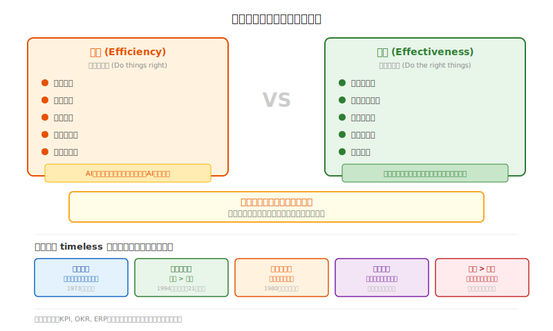

## 第二章：德鲁克为什么还没过时

*"知之者不如好之者，好之者不如乐之者。"*
——孔子

有一次老W读到一段话，说1999年有个90岁的老头子接受了《华尔街日报》的采访。记者问他：你这一辈子预测错了什么？

他想了很久，说：我唯一后悔的，是低估了这场革命的速度。

就这么一句话。老头子没给自己找借口，也没吹牛，就老老实实说低估了。

老W愣住了。

你想啊，换成大多数人，被问到错了没有，第一反应是不是辩护？“那个情况太特殊了”，“我没料到黑天鹅”，“这不能怪我”……

但他不是。他在90岁的时候，还能承认自己的判断有偏差，而且说得那么精准——“低估了速度”。

这让老W想了一个晚上。

---

后来老W才慢慢明白，这老头子厉害的地方，不是预测得多准，而是他从来不把自己押在具体的预测上。他研究的是人，是组织，是“什么东西能让一个群体持续运转”。这些东西，几千年前的人性和今天的人性，没多大区别。

所以他不过时。

---

先说技术。

管理技术这玩意儿，更新换代比程序员换框架还快。MBO、KPI、平衡计分卡、360度评估……每一个出来的时候都是“革命性突破”，过几年就成了“传统做法”。老W刚入行那会儿，OKR火得不行，现在呢？又开始有人批判了。

ERP那句老话怎么说的来着？“上ERP找死，不上ERP等死”。技术的尴尬就在这儿——你追，它淘汰得比你快。

但德鲁克的哲学不一样。

他说，组织的目的是让平凡的人做出不平凡的事。

听着像正确的废话，对吧？老W当年也觉得是废话。但后来他在带团队的时候慢慢发现，能持续打胜仗的团队，恰恰就是那些能让普通人发挥出超常水平的团队。把人当零件使唤的，往往短期有效，长期乏力。

这道理1973年他写《管理：任务、责任、实践》的时候就说了。到了AI时代，反而更对了——机器能做的越来越多，人的价值越来越体现在那些机器干不了的事情上：判断、创造、连接、赋予意义。

---

说起来，德鲁克最让老W佩服的一点，是他1994年就写了一本《管理挑战21世纪》。

那时候互联网还是个稀罕物，亚马逊两年后才成立，谷歌五年后，Facebook十一年后。

但他在书里说：21世纪最重要的资源是知识，不是资本；知识工作者需要的不只是工资，还有意义；组织形式要从命令-控制变成网络结构。

这不就是在说后来的互联网公司吗？

老W有个朋友在某大厂做HR，前几年公司搞“组织变革”，请了顶级咨询公司，方案做得漂漂亮亮，数据表格一堆。执行了三个月，团队怨声载道，HR总监被撤了，咨询费打了水漂。

问题出在哪儿？咨询公司研究的是“最佳实践”，但德鲁克会问：“你组织里的人是什么人？他们想要什么？”

脱离了对人的理解，什么方案都是空中楼阁。

---

德鲁克还干了一件特别牛的事——1980年写了本《动荡时代的管理》。

那会儿美国刚打完越战，石油危机，经济滞胀，企业界被折腾得够呛，都盼着回到60年代的黄金岁月。

结果他在这时候告诉你：别想了，动荡不是意外，是常态。你得学会在不确定里活着，而不是整天想着消除不确定。

当时肯定没人爱听。

但你看看2020年。多少公司的“五年战略”成了废纸？多少“稳健经营”的公司现金撑不过三个月？反而是那些看起来“疯狂”的公司——字节、拼多多——在混乱里冲出来了。

这不就印证了《孙子兵法》那句话：“兵无常势，水无常形”。

有意思的是，塔勒布后来在《反脆弱》里说的更狠：最强的系统不是抗波动，而是在波动里变强。跟德鲁克说的几乎是同一回事，只是换了个说法。

---

还有一个老W觉得特别实在的观点——效果比效率重要。

管理学界老吵这个，答案都是“都重要”。听起来没错，但“都重要”在实践里往往是“我不知道哪个重要，所以两个都抓”。

德鲁克不跟你和稀泥：**效果第一，效率第二。**

效率是把事情做对，效果是做对的事情。先问自己做的事对不对，再问做得快不快。好比你往墙上钉钉子，你效率再高，钉歪了有什么用？

这话他在《有效的管理者》里说过，老W记了十几年。

到了AI时代，这话更扎心。AI就是效率神器，同样的数据分析，人要几天，AI几秒钟搞定。组织没AI，在效率上就被碾压。

但问题来了：你拿AI把贷款审批从三天缩到三分钟，风控模型有没有偏见？监管风险评估了吗？算法决策说得清楚吗？

没想清楚这些，效率越高，埋的雷越大。

老W以前公司就这么栽过。老板天天喊效率效率，结果项目交付是快了，质量稀烂，返工的时间比省下的还多。

这不是故事，是事故。

---

德鲁克还有一句话老W特别喜欢：管理不是告诉别人做什么，是让人发挥优势。

听着简单，做起来难。

大多数老板的真实想法是“我花钱雇你，你给我干活”。你的优势是什么，你能不能成长——那是你的事。

这就跟麦克格雷戈说的Theory X和Theory Y对上了。大多数管理者默认的是Theory X：员工天生懒，得看着。Theory Y是说人本来就有自驱力，愿意负责，有潜力。哪个更接近现实？你自己心里有数。

王阳明那句话用在这儿也合适：“知者行之始，行者知之成。”知和行分不开。你怎么对员工，员工就怎么对工作。

把员工当成本，得到的也是成本。

反过来，当AI替代了那些标准化流程以后，人的价值就剩那些机器干不了的：发现问题的洞见，创造新东西的想象力，处理复杂关系的敏感度，还有赋予工作意义的能力。

德鲁克这套人本主义的管理哲学，在AI时代不是过时了，而是被证明了——只不过证明的方式有点残酷。

---

当然，老W觉得捧德鲁克也得有个度。

他有些判断确实过时了。比如他曾经觉得日本管理模式会取代美国模式，结果90年代日本泡沫崩了。这事儿他也没再提过，但确实看走眼了。

还有一个更根本的问题：他整套管理思想，建立在一个前提上——组织是社会的基本单元，是实现个人价值的主要场所。

这个前提现在正被动摇。

平台经济、零工经济、远程工作——当你不在任何一家公司，而是同时在几个平台上接活，“组织”对你意味着什么？德鲁克没看到这些，但他的思考方式能帮我们想清楚这些问题。

所以老W觉得，学德鲁克，不是背他的语录，而是学他问问题的方式：什么是本质？什么该做，什么不该做？

德鲁克自己说过一句话：战略规划不是什么技术创新，而是决定我们今后做什么的决策。

这话挺有意思的。战略的本质是选择——选择不做什么。

---

最后说个老W印象深刻的细节。

德鲁克有个习惯：每隔三四年，他选一个主题，把相关书和文献全读一遍，然后写一本书。他的目的不是重复已有的观点，是要理解一个问题的全貌。

说白了，这人一辈子都在学习，而且学习的方法是深度思考而不是广度收集。

这年头最不缺的就是信息。AI的书籍文章播客视频，每分钟都在冒出来。但信息多不等于判断力强。在噪音里找到核心问题，然后用足够长的时间足够深的思考去逼近它——这才是德鲁克教给我们的。

圣吉在《第五项修炼》里说的“学习型组织”，大概也是这个意思——一个能持续学习、适应、进化的地方。

AI时代，什么样的组织是好组织？这个问题太大，老W答不了。但德鲁克的方法论能给一点线索：回到本质，回到人，回到长期。

回到开头那个90岁的老头子。他说他低估了变化的速度。

也许正因为他不假装自己能预测未来，他才能持续追问那些不变的问题——什么是组织，什么是效果，人为什么要工作。

只要这些问题还在，德鲁克就还在。

---

*老W写完这章，回头看了一遍，觉得关于效果那节的例子还是有点干。下次找个更生动的案例再改吧。先这样。*
