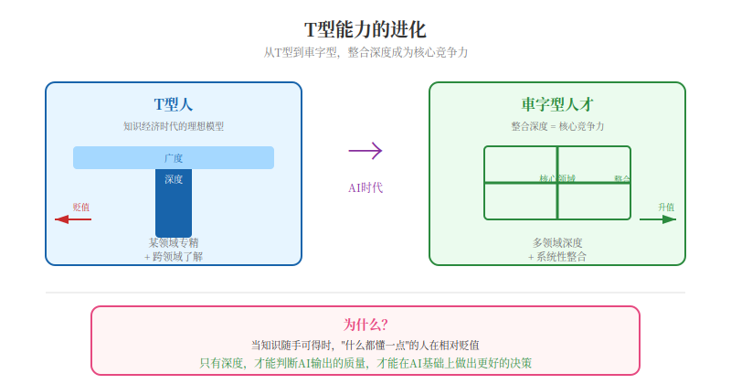

## 第十八章：T型能力的进化——从深度+广度到整合深度

*"通才的优势在于他们能够看到别人看不到的联系。"*
——赫伯特·西蒙

---

老W年轻的时候，特别崇拜那种"什么都懂"的人。跟你聊历史他头头是道，跟你聊科技他如数家珍，跟你聊财经他分析得鞭辟入里。他当时觉得，这人真厉害，他要能成这样就好了。

后来他自己努力了十几年，终于成了一个"什么都懂一点，什么都不精"的人。

然后他发现，没人找他聊"什么都懂"的天了。

大家找他，都是因为他会写代码；或者因为他会做PPT；或者因为他在这个行业干了二十年，认识一些人。这些"深度"的东西，反而是大家需要的。他那个"广度"，在酒桌上吹吹牛还行，在工作上一点用都没有。

这让他开始思考一个问题：到底什么能力，才是AI时代真正值钱的？

---

先说T型人。

管理学界有个概念叫"T型人"——竖线代表深度，横线代表广度，既在某个领域有专业能力，又对其他领域有所了解。这个概念八十年代从麦肯锡出来，后来被IDEO那帮人用得很广。

知识经济时代，T型人确实是理想模型。能深度贡献，又能跨领域协作，组织里很吃香。

但AI时代，这个模型在失效。

原因也简单：AI能在几乎任何领域提供比大多数人类更准确的知识时，"广度"就不值钱了。你不需要学财务，AI能给你分析。你不需要学编程，AI能给你写代码。你不需要学营销，AI能给你出方案。

当知识随手可得时，"什么都懂一点"的人在相对贬值。

但深度不一样。那些在单一领域有真正深度的人，价值反而在上升。因为只有深度，才能判断AI输出的质量，才能在AI基础上做出更好的决策。

就像你会修手表，以前得懂机芯、懂游丝、懂擒纵。现在有AI了，你只需要说"帮我修一下"，AI诊断是游丝断了，你拿去修就行。那个"广度"——知道手表怎么工作的——没那么值钱了。

---

那广度腿不行之后，什么开始值钱？

**整合深度。**

就是能把多个领域的知识深度整合起来的能力。AI能提供任何领域的知识，但不会"自然地"把它们整合。它需要人指导——告诉它整合哪些领域、用什么方式整合、目标是什么。

这种整合，是人的独特能力。

AI像一盒乐高积木，什么零件都有，但拼成什么样子，得你来定。你得知道想拼个城堡，得选哪些积木、怎么拼、门朝哪开。

所以他琢磨出一个新模型：**車字型人才**。

車字，外面一圈是个"田"，中间一个"十"。这个"田"就是你的核心基本盘——职业大本营、立身底盘，所有能力都从这儿生发。

然后往下，是深耕。往底层扎——专业底层逻辑、基本功、经验沉淀、方法论、落地实操。越往下越扎实，别人挖不动你。

往上，是前沿，也是担当。往顶层看——行业趋势、新技术、新玩法、战略视角、未来风口。但更重要的是，你站在这个位置，是为了让下面的人有路可走，有方向可循。站得高不是为了让别人仰望，而是因为你知道方向，得负责指路。

左右两横，是跨界辐射。横向打通——跨部门、跨技能、跨人脉、跨业务。拓宽影响力边界。

最底下那一横，是人生兜底底盘。心性、自律、抗压、执行力、稳定度。托住整个人不飘不塌。

浓缩成一句话就是：**田为核心基本盘，向下扎深耕功底，向上探前沿且有担当，左右做跨界辐射，底横守立身本心。**

---

为什么整合深度在AI时代更值钱？有三个原因。

**第一，AI是模块化的，整合需要人。**

AI在各个领域强，但它不会"自然"跨领域整合。它需要人的指导。这种整合能力，是人的独特价值。

**第二，创新发生在知识边界上。**

真正的创新，往往不在某一领域内部，而在不同领域的交叉点。你懂医学又懂AI，就能发现AI辅助诊断的机会；你懂金融又懂心理学，就能发现行为金融学的应用。

两堵墙交界的地方最容易出裂缝——创新也是这样。

**第三，AI加剧了信息过载。**

当AI能提供几乎无限的知识时，信息过载不是减轻了，是加重了。知道什么重要、什么可以忽略、什么优先处理——这些判断在信息过载时代更关键。

就像你有一柜子衣服，但出门只能穿一套。你得知道什么场合穿什么、怎么搭配。这种判断力，不是因为你知道很多，而是因为你穿过很多、失败过很多次。

---

怎么成为車字型人才？

第一步，在"田"字里找到你的核心基本盘，在一个领域建立真正的深度。选择领域时问自己：你对什么有真正的热情？什么领域足够复杂让你持续深入？什么领域在AI时代仍需要真正的人类判断？

第二步，战略性地发展"下"和"上"。往深了耕，往前沿探。一个数据科学家，如果同时对行为心理学有深度理解，就更容易创造出既符合数据分析又符合人类行为洞察的产品。

第三步，刻意练习"左右"的整合。深度知识不会自动整合。尝试用两个领域的框架分析同一个问题，参加跨领域项目，与其他领域的深度专家深度交流。

---

说完个人，再说组织。

组织想培养車字型人才，有几个办法。

招聘时，评估整合能力比评估单一深度更重要。面试里问一些需要跨领域整合的问题，观察候选人的思考过程。

培养时，创造跨领域经验。跨部门项目、跨领域轮岗、跨学科社群，让员工有机会在不同领域干活。

晋升时，认可整合价值。如果晋升只认单一领域的深度，员工就只发展单一深度。想培养車字型人才，就得在晋升标准里给跨领域整合能力加分。

---

T型模型在工业时代和早期知识经济时代是好用的。AI时代，得进化成車字模型。

車字型人才不是在每个领域都略知一二的通才，而是在"田"字核心有扎实根基，往下深耕、往上探前沿、左右跨界辐射、底横稳住本心，同时能把这些整合起来的人。

当AI让知识变得普遍可获取时，整合知识的能力比拥有知识本身更有价值。

赫伯特·西蒙说"通才的优势在于他们能够看到别人看不到的联系"——这话没错。但AI时代还得加一句：車字型人才的优势在于他们能够创造别人创造不出的整合。

---

*老W写完这章，对着镜子看了看自己——田字核心是写代码，往下深耕了点管理经验，往上探了点AI趋势，左右跨了点设计和运营，底横……底横还行，抗造。这么一想，好像也不是完全没戏。就是头发少了点。*
